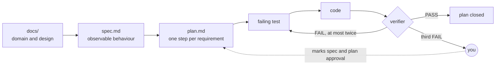

# My Factory

[](https://github.com/JNico-rb/my-factory/actions/workflows/verify.yml)

**A harness to start every AI-built project on rails.** A Claude Code plugin marketplace whose `sdd` plugin scaffolds a spec-driven project, interviews you until its open decisions are closed, and then enforces its own gates with deterministic hooks, an implementer, and an independent verifier.

> An agent's output is not deterministic. What makes the result trustworthy is not a better prompt but **validators**: checks that run at a fixed point, give the same verdict every time, and block instead of advising. **The model proposes; code decides.**

## What you get

| Piece | Kind | What it guarantees |
|---|---|---|
| `/sdd:new-project` | skill | A new repo with `docs/` → `specs/` → plan → tests → code, and every template gap closed by a grill, not a guess |
| `guard-secrets` | hook | No write carries anything shaped like a real credential |
| `guard-plan` | hook | No test or code is written unless an approved plan has an open step |
| `sdd:implementer` | agent | One approved plan, TDD step by step, a commit per green step |
| `sdd:verifier` | agent | Nobody closes their own work: it traces each step to its test, runs every gate, and alone marks *Closing* |
| `sdd:security-auditor` | agent | Injection paths, data isolation, dependencies and git history checked before a delivery |
| `/sdd:verification` | skill | A verification plan where every element has one technique and one T/A/I/D/U class, and accepted risks are named |
| `/sdd:wayfinder` | skill | An effort too big for one session becomes a map of decision tickets |
| template CI | workflow | The quality gates on every push, and a gitleaks scan of the whole history |

## Quick start

Once per machine, from any Claude Code session:

```
/plugin marketplace add JNico-rb/my-factory
/plugin install sdd@my-factory
```

Then, in an empty directory: `/sdd:new-project`. Projects created that way declare this marketplace in `.claude/settings.json`, so whoever clones one is offered the plugin when they trust the folder. Requires Node for the hooks.

## How a project runs



Each layer is asked for by the one above it; anything no layer asks for is drift. Three rings enforce that, from the cheapest to the widest:

| Ring | When it acts | Enforced by |
|---|---|---|
| **Before the write** | every `Edit`/`Write` of the agent | `guard-secrets`, `guard-plan` (exit 2 blocks the call and tells the model why) |
| **Before closing** | when an implementation says it is done | `sdd:verifier`: step ↔ test traceability, suites, scope |
| **Before merging** | every push | template CI: quality gates, secrets in the history |

Approval boxes are marked **only by you**. The template's `AGENTS.md` says so, and `guard-plan` makes it true.

## Repo layout

```
my-factory/
├── .claude-plugin/marketplace.json   # the marketplace: which plugins exist, where each lives
├── plugins/sdd/                      # the plugin: only this folder reaches an install
│   ├── skills/                       #   new-project (+ template/), grill-me, wayfinder, verification
│   ├── agents/                       #   implementer, verifier, security-auditor
│   └── hooks/                        #   guard-secrets, guard-plan, and their tests
├── scripts/verify.sh                 # the factory's own checks; CI runs the same script
├── docs/                             # the knowledge behind it: course notes, research, links
├── ROADMAP.md                        # what could come next, ordered by value over cost
└── .claude/                          # agents and scripts used inside this repo only
```

## The factory verifies itself

```bash
bash scripts/verify.sh
```

One line per check: JSON configs parse; marketplace and plugin pass `claude plugin validate --strict`; the hook tests pass; the template scaffolds, refuses to overwrite, reports its gaps, checks clean once filled and rejects an `AGENTS.md` over 200 lines; every relative link resolves. [CI](.github/workflows/verify.yml) runs it on every push.

## Changing a plugin

1. Edit it under `plugins/<name>/`.
2. Try it without publishing: `claude --plugin-dir <path-to>/plugins/<name>` from a scratch directory.
3. Bump `version` in its `.claude-plugin/plugin.json`: installs only update when it changes.
4. `bash scripts/verify.sh` is green.
5. Commit and push. Installs follow on the marketplace's auto-update (enable it in `/plugin`), or at once with `claude plugin update sdd@my-factory` and `/reload-plugins`.

## Further reading

- [plugins/sdd/README.md](plugins/sdd/README.md) — every skill, agent and hook, with provenance and licences.
- [docs/](docs/README.md) — the concepts it rests on, and where each one landed in the plugin.
- [ROADMAP.md](ROADMAP.md) — validator registry, iteration and red-team logs, loop specs, formal starters, evals.
